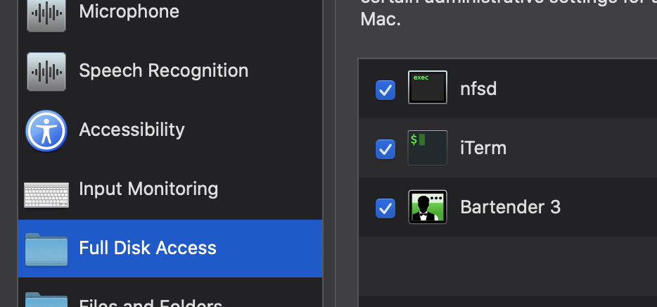

# dpl-cms
CMS of the Danish Public Libraries.

# Publishing new version of source image
When you run: `task source:deploy` a new docker image will be build and deployed to the container registry.
The image contains the source code of the DPL cms project.

# Running a local development
If you want to develop and maintain the DPL cms project locally you can run: `dev:setup`.
The command builds the site with dependencies and starts the required docker containers.

## Prerequisities
In order to run local development you need:
* go-task, https://taskfile.dev
* docker

## Other initial steps

If you are using a mac/OSX it is recommended to use nfs on the mounted volumes in docker-compose.

Thhe following guide explains how to do that:

### Setup NFS (for mac/OSX users)

First copy the docker-compose.mac-nfs.yml file to override some of the network settings:

`cp docker-compose.mac-nfs.yml docker-compose.override.yml`

#### First-time setup of NFS

If you want to use NFS, you'll need to do various things the very first time.

/etc/exports should contain information about your code folder

Assuming you're keeping your docker/code projects in ~/code, you'll want to add this line to your /etc/exports:

/System/Volumes/Data/Users/<USERNAME>/code -mapall=<USERNAME>:staff -alldirs localhost

#### Full access

/sbin/nfsd and your terminal program needs "full disk access":

#### Update your nfs.conf

Your /etc/nfs.conf file should contain the following line:

nfs.server.mount.require_resv_port = 0

Adding /System/Volumes/Data to docker for mac filesharing

After you've done all this, either restart your mac or:

* `sudo nfsd restart`
* restart docker for mac
* close and re-open your terminal (not just a new prompt!)