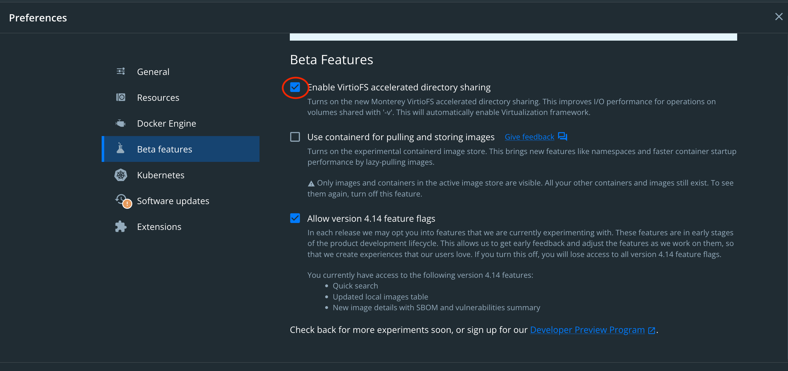

# dpl-cms

This is the main repository used for building the core Drupal CMS which is used
by the danish public libraries

## Running a local development

If you want to develop and maintain the DPL cms project locally you can run:
`dev:reset`. The command builds the site with dependencies and starts the
required Docker containers.

## Prerequisites

In order to run local development you need:

* [`go-task`](https://taskfile.dev)
* Docker
* Preferably support for `VIRTUAL_HOST` environment variables for Docker
  containers. Examples: [Dory (OSX)](https://github.com/FreedomBen/dory) or
  [`nginx-proxy`](https://github.com/nginx-proxy/nginx-proxy).

## Other initial steps

If you are using a mac/OSX it is recommended to use [VirtioFS](https://virtio-fs.gitlab.io)
on the mounted volumes in docker-compose.

In your Docker for mac preference you need to activate VirtioFS for directory sharing:



## Building and publishing releases

A release of dpl-cms can be build by pushing a tag that matches the following
pattern:

```shell
# Replace <version> with the version.
git tag <version>

# Eg.
git tag 1.2.3
```

The actual release is performed by the `Publish source` Github action which
invokes `task source:deploy`  which in turn uses the tasks `source:build` and
`source:push` to build and publish the release.

Using the action should be the preferred choice for building and publishing
releases, but should you need to - it is possible to run the task manually
given you have the necessary permissions for pushing the resulting source-image.
Should you only need to produce the image, but not push it the task you can opt
for just invoking the `source:build` task.

You can override the name of the built image and/or the destination registry
temporarily by providing a number of environment variables (see the
[Taskfile](Taskfile.yml)). To permanently change these configurations, eg. in
a fork, change the defaults directly in the `Taskfile.yml`.
