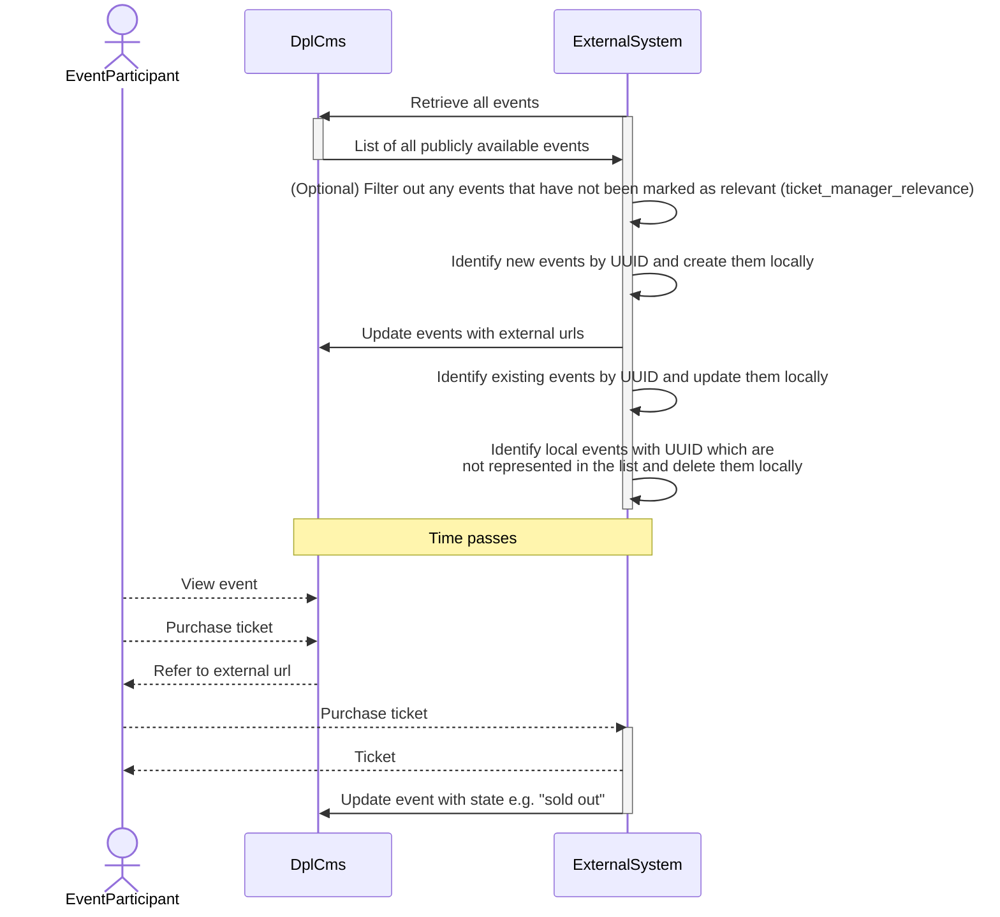

# Event integration

Events make up an important part of the overall activities the Danish Public
Libraries. One business aspect of these events is ticketing. Municipalities
in Denmark use different external vendors for handling this responsibility
which includes functionalities such payment, keeping track of availability,
validation, seating etc.

On goal for libraries is to keep staff workflows as simple as possible and
avoid duplicate data entry. To achieve this DPL CMS exposes data and
functionality as a part of [the public API of the system](./architecture/adr-006-api-specification.md).

## Data synchronization

[The public API for DPL CMS is documented through an OpenAPI 2.0 specification](../openapi.json).

The following flow diagram represents a suggested approach for synchronizing
event data between DPL CMS and an external system.

<!-- markdownlint-disable MD013 -->

<!-- markdownlint-enable MD013 -->

## Authentication

An external system which intends to integrate with events is setup in the same
way as library staff. It is represented by a Drupal user and must be assigned
an appropriate username, password and role by a local administrator for the
library. This information must be communicated to the external system through
other secure means.

The external system must authenticate through [HTTP basic auth](https://swagger.io/docs/specification/2-0/authentication/basic-authentication/)
using this information when updating events.

## API versioning

Please read [the related ADR](./architecture/adr-011-api-versioning.md) for how
we handle API versioning.
