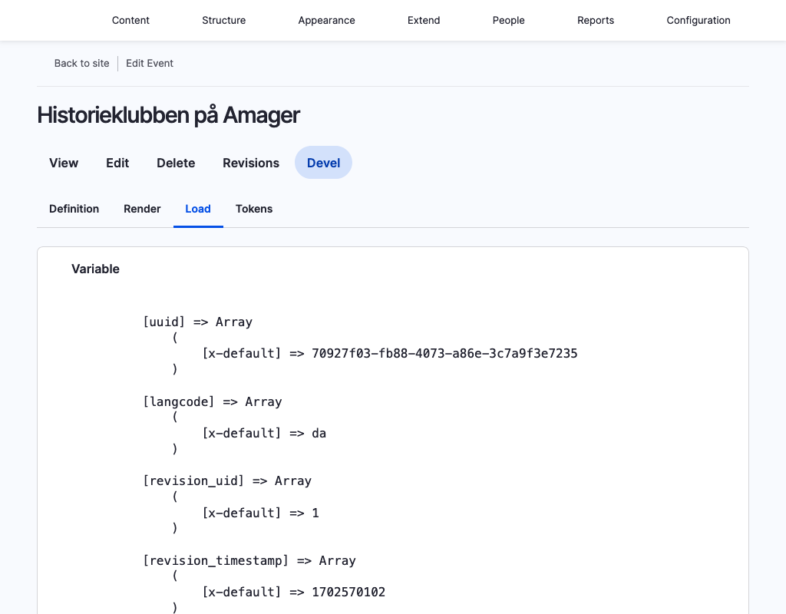

# Example content

We use the [Default Content module](https://www.drupal.org/project/default_content)
to manage example content. Such content is typically used when setting up
development and testing environments.

All actual example content is stored with the DPL Example Content module.

Usage of the module in this project is derived from [the official documentation](https://www.drupal.org/docs/contributed-modules/default-content-for-d8/defining-default-content).

## Howtos

### Add additional default content

1. Create the default content
2. Determine the UUIDs for the entities which should be exported as default
   content. The easiest way to do this is to enable the Devel module, view
   the entity and go to the Devel tab.
   
3. Add the UUID (s) (and if necessary entity types) to the
   `dpl_example_content.info.yml` file
4. Export the entities by running `drush default-content:export-module dpl_example_content`
5. Commit the new files under `web/modules/custom/dpl_example_content`

### Update existing default content

1. Update existing content
2. Export the entities by running `drush default-content:export-module dpl_example_content`
3. Remove references to and files from UUIDs which are no longer relevant.
4. Commit updated files under `web/modules/custom/dpl_example_content`
