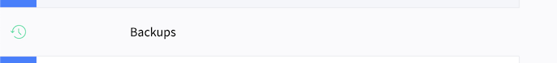
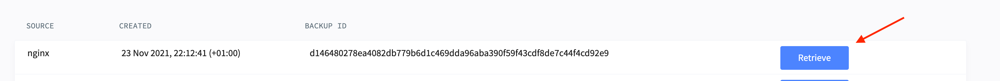

# Local development

## Docker setup

### Requirements

In order to run local development you need:

* [`go-task`](https://taskfile.dev)
* Docker
* Preferably support for `VIRTUAL_HOST` environment variables for Docker
  containers. Examples: [Dory (OSX)](https://github.com/FreedomBen/dory) or
  [`nginx-proxy`](https://github.com/nginx-proxy/nginx-proxy).

### MacOS and Docker

If you are using MacOS, you can use the standard
"[Docker for Mac](https://docs.docker.com/desktop/install/mac-install/)"
app, however there has been developers that have experienced it acting slow.

Alternatively, you can use [Orbstack](https://orbstack.dev/), which is a
direct replacement for Docker for Mac, but is optimized to run much faster.

### Docker for Mac

If you do end up using Docker for Mac, it is
recommended to use [VirtioFS](https://virtio-fs.gitlab.io) on the mounted
volumes  in docker-compose, to speed up the containers.


### Configuration of https

Install mkcert on your host machine and generate and install a root certificate
by running mkcert -install on your host machine (one time only).

Mac users can run: `brew install mkcert` to install mkcert

Then run:

`mkcert -install`

Mac users should then do (one time only):

$ mkdir -p ~/.local/share && ln -s "$(mkcert -CAROOT)" ~/.local/share

#### If you are using Dory

Update the ssl_certs_dir as described here:

[https://github.com/reload/drupal-apache-fpm?tab=readme-ov-file#using-autogenerated-certificates](https://github.com/reload/drupal-apache-fpm?tab=readme-ov-file#using-autogenerated-certificates)

## Howtos

### Enable XDebug

Prerequisites:

* An IDE with support for XDebug e.g. JetBrains PhpStorm
* Optionally: [A browser extension to activate XDebug](https://xdebug.org/docs/step_debug#browser-extensions)

For performance reasons XDebug is disabled by default. It can be enabled
temporarily through a task:

1. Run `task dev:enable-xdebug`
2. Validate that XDebug is enabled by inspecting <http://dpl-cms.docker/admin/reports/status/php>.
   It should contain extended information about XDebug
3. Debug the application by setting breakpoints, listen for incoming
   connections in your IDE and [activate XDebug from you client/browser](https://xdebug.org/docs/step_debug#web-application)
4. When you are finished, hit `enter` in the terminal where you enabled XDebug.
   This will disable XDebug

### Download database and files from Lagoon

#### Retrieve the latest backup of database and files from Lagoon

Prerequisites:

* [A connected Lagoon CLI](https://github.com/danskernesdigitalebibliotek/dpl-platform/blob/main/docs/runbooks/connecting-the-lagoon-cli.md)
* [`jq`](https://jqlang.github.io/jq/) installed locally

Run the following command to retrieve the latest backup of database and files
from a Lagoon project:

```bash
LAGOON_PROJECT=<lagoon-project-name> task lagoon:backup:restore
```

#### Copy a specific database snapshot from Lagoon environment to local setup

Prerequisites:

* Login credentials to the Lagoon UI, or an existing database dump

The following describes how to first fetch a database-dump and then import the
dump into a running local environment. Be aware that this only gives you the
database, not any files from the site.

1. To retrieve a database-dump from a running site, consult the
   "[How do I download a database dump?](https://docs.lagoon.sh/lagoon/resources/tutorials-and-webinars#how-do-i-download-a-database-dump)"
   guide in the official Lagoon. Skip this step if you already have a
   database-dump.
2. Place the dump in the [restore/database](../restore/database) directory, be aware
   that the directory is only allowed to contain a single `.sql` file.
3. Start a local environment using `task dev:reset`
4. Import the database by running `task dev:restore:database`

#### Copy a specific snapshot of files from Lagoon environment to local setup

Prerequisites:

* Login credentials to the Lagoon UI, or an existing nginx files dump

The following describes how to first fetch a files backup package
and then replace the files in a local environment.

If you need to get new backup files from the remote site:

<!-- markdownlint-disable ol-prefix -->
1. Login to the lagoon administration and navigate to the project/environment.
2. Select the backup tab:



3. Retrieve the files backup you need:


4. Due to a UI bug you need to RELOAD the window and then it should be possible
   to download the nginx package.
<!-- markdownlint-enable ol-prefix -->

Replace files locally:

1. Place the files dump in the [files-backup](../files-backup) directory, be aware
   that the directory is only allowed to contain a single `.tar.gz` file.
2. Start a local environment using `task dev:reset`
3. Restore the filesš by running `task dev:restore:files`

### Get a specific release of dpl-react - without using composer install

In a development context it is not very handy only
to be able to get the latest version of the main branch of dpl-react.

So a command has been implemented that downloads the specific version
of the assets and overwrites the existing library.

You need to specify which branch you need to get the assets from.
The latest HEAD of the given branch is automatically build by Github actions
so you just need to specify the branch you want.

It is used like this:

```bash
BRANCH=[BRANCH_FROM_DPL_REACT_REPOSITORY] task dev:dpl-react:overwrite
```

Example:

```bash
BRANCH=feature/more-releases task dev:dpl-react:overwrite
```
