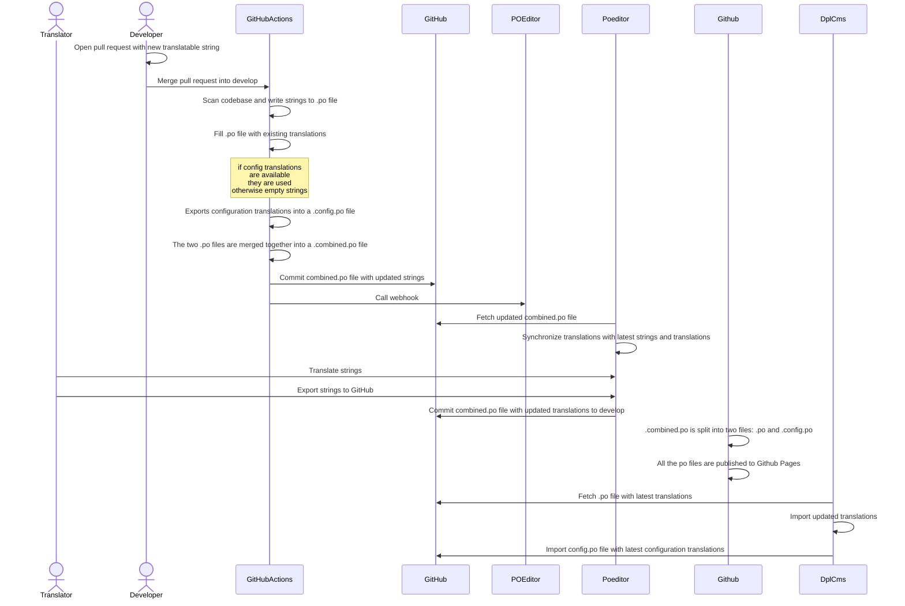

# Translation

We manage translations as a part of the codebase using `.po` translation files.
Consequently translations must be part of either official or local translations
to take effect on the individual site.

DPL CMS is configured to use English as the master language but is configured
to use Danish for all users through language negotiation. This allows us to
follow a process where English is the default for the codebase but actual usage
of the system is in Danish.

## Translation system

To make the "translation traffic" work following components are being used:

* GitHub
  * [Stores `.po` files in git](web/profiles/dpl_cms/translations/da.po) with
    translatable strings and translations
* [GitHub Actions](.github/workflows/translations.yml)
  * Scans codebase for new translatable strings and commits them to GitHub
  * Exports translatable configuration strings into a separate `*.config.po` file
  * Merges the two files: `*.po` and `*.config.po` into a `*.combined.po` file
  * Notifies POEditor that new translatable strings are available
  * When a project is exported from POEditor:
    * The `*.combined.po` is split into two files: `*.po` and `*.config.po`
    * The `*.po` files are published to GitHub Pages
* POEditor
  * Provides an interface for translators
  * Links translations with `.po` files on GitHub
  * Provides webhooks where external systems can notify of new translations
* DPL CMS
  * Drupal installation which is [configured to use GitHub Pages as an interface
    translation server](web/profiles/dpl_cms/dpl_cms.info.yml) from which `.po`
    files can be consumed.
  * In the development setup and in cronjobs defined in the environments there are two jobs in charge of importing the regular translations and the configuration translations.

The following diagram show how these systems interact to support the flow of
from introducing a new translateable string in the codebase to DPL CMS consuming
an updated translation with said string.

case



## Howtos

### Add new or update existing translation

1. Log into POEditor.com and go to the `dpl-cms` project
2. Go to the relevant language
3. Locate the string (term) to be translated
4. Translate the string

### Publish updated translations

1. Log into POEditor.com
2. Select the "Settings" tab
3. Click the GitHub code hosting service
4. Check the relevant language(s)
5. Select "Export to GitHub" and click "Go"

### Import updated translations

1. Run `drush locale-check`
2. Run `drush locale-update`

### Import updated config translations

Run  `drush dpl_po:import-remote-config-po [LANGUAGE_CODE] [CONFIGURATION_PO_FIL_EXTERNAL_URL]`

Example:
```bash
drush dpl_po:import-remote-config-po da https://danskernesdigitalebibliotek.github.io/dpl-cms/translations/da.config.po
```
