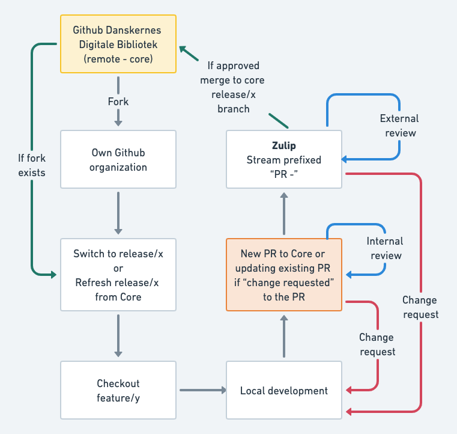

# DPL CMS Documentation

The documentation in this folder describes how to develop DPL CMS.

The focus of the documentation is to inform developers of how to develop the
CMS, and give some background behind the various architectural choices.

## Layout

The documentation falls into two categories:

The Markdown-files in this
directory document the system as it. Eg. you can read about how to add a new
entry to the core configuration.

The [./architecture](architecture/) folder contains our
[Architectural Decision Records](https://adr.github.io/)
that describes the reasoning behind key architecture decisions. Consult these
records if you need background on some part of the CMS, or plan on making any
modifications to the architecture.

As for the remaining files and directories

* [./diagrams](diagrams/) contains diagram files like draw.io or PlantUML and
  rendered diagrams in png/svg format. See the section for details.
* [./images](images/) this is just plain images used by documentation files.
* [./Taskfile.yml](Taskfile.yml) a [go-task](https://taskfile.dev) Taskfile,
  run `task` to list available tasks.

## Diagrams

We strive to keep the diagrams and illustrations used in the documentation as
maintainable as possible. A big part of this is our use of programmatic
diagramming via [PlantUML](https://plantuml.com/) and Open Source based
manual diagramming via [diagrams.net](https://www.diagrams.net/) (formerly
known as draw.io).

When a change has been made to a `*.puml` or `*.drawio` file, you should
re-render the diagrams using the command `task render` and commit the result.

## Using GitHub to contribute

No direct commits are allowed to this project. To contribute to the project you
must follow a standard pull request based workflow. Please fork the relevant
repositories and keep them in sync with Core. Then open a pull request from your
fork back to core with your changes. Once a pull request is approved by one of
the core team members it will be merged back into core.

### Add remote core repository

After forking a repository you can add the parent/Core repository to you local
clone by adding a new remote.

```shell
git remote add core https://github.com/danskernesdigitalebibliotek/<REPOS>.git
```

If your local fork don't have the current release branch you should create it
and ensure it is in sync with Core.

```shell
git checkout main
git pull origin
git fetch core
git checkout -b release/x
git rebase core/release/x release/x
git push --set-upstream origin release/x
```

### Refresh release existing branch

You will need to refresh/sync your branches in the fork base on changes in core.

```shell
git checkout main
git pull origin
git checkout <BRANCH>
git fetch core
git rebase core/<BRANCH> <BRANCH>
git push origin <BRANCH>
```

### Flow illustration

This flow chart explains the workflow support by the git commands in the
sections above.


