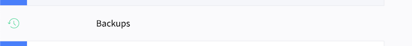
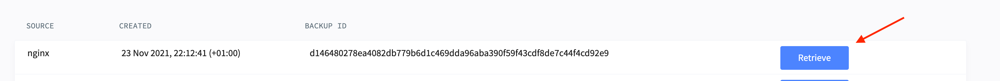

# Local development

## Copy database from Lagoon environment to local setup
Prerequisites:
* Login credentials to the Lagoon UI, or an existing database dump

The following describes how to first fetch a database-dump and then import the
dump into a running local environment. Be aware that this only gives you the
database, not any files from the site.

1. To retrieve a database-dump from a running site, consult the "[How do I download a database dump?](https://docs.lagoon.sh/lagoon/resources/tutorials-and-webinars#how-do-i-download-a-database-dump)" guide in the official Lagoon. Skip this step if you already have a database-dump.
2. Place the dump in the [database-dump](../database-dump) directory, be aware
   that the directory is only allowed to contain a single `.sql` file.
3. Start a local environment using `task dev:reset`
4. Import the database by running `task dev:restore:database`

## Copy files from Lagoon environment to local setup
Prerequisites:
* Login credentials to the Lagoon UI, or an existing nginx files dump

The following describes how to first fetch a files backup package
and then replace the files in a local environment.

If you need to get new backup files from the remote site:
1. Login to the lagoon administration and navigate to the project/environment.
2. Select the backup tab:

3. Retrieve the files backup you need:

4. Due to a UI bug you need to RELOAD the window and then it should be possible to download the nginx package.

Replace files locally:
1. Place the files dump in the [files-backup](../files-backup) directory, be aware
   that the directory is only allowed to contain a single `.tar.gz` file.
2. Start a local environment using `task dev:reset`
3. Restore the filesš by running `task dev:restore:files`
