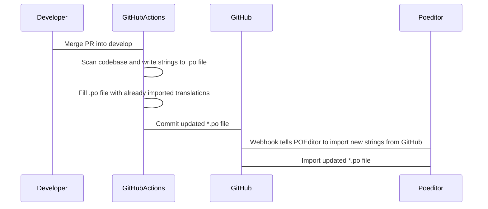
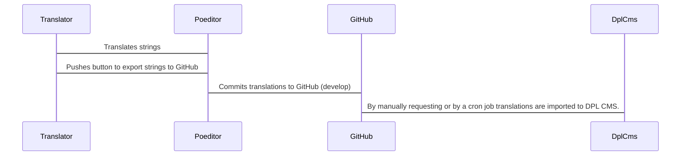

# Translation System

## Components

To make the "translation traffic" work following components are being used:

* Git. By having the *.po fiules in git it enables us to React to changes and
contact relevant services when changes occur
* POEditor Webhook. Which is used to tell POEditor
when it should look for new translations
* SendToPoeditor Github Action step. Scans and commits translations.
And notifies POEditor that new translations are present.
* PublishToGithubPages Github Action step. Publishes the new *.po file to
Github Pages which is used as a translation server for the library sites.

## Subscribing to translations

Because the translation server is defined in the dpl_cms profile
(dpl_cms.info.yml) it is possible to track changes and update the translations
on the individual library sites.

## New translation

## Add or update translation

