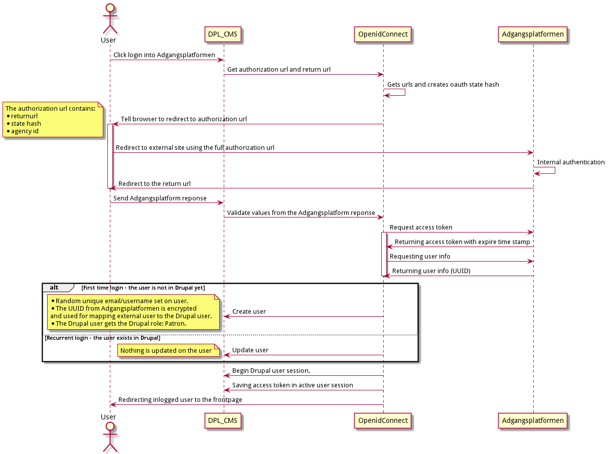

INTRODUCTION
------------
The module is handling authentication of a user
via the external "Adgangsplatformen" login.

You can read more about the external service here:
https://github.com/DBCDK/hejmdal
And test it here:
https://login.bib.dk

If the user gets authenticated externally the user is redirected
to the dpl-cms site and gets logged in as a drupal user.

Decisions about general handling of users are described [here][1].

REQUIREMENTS
------------
This module requires the following modules:

 * [OpenID Connect / OAuth client](https://www.drupal.org/project/openid_connect)
 * [DPL Library Token](../dpl-cms/web/modules/custom/dpl_library_token)
 * An Oauth2 client id/secret need to be generated by DBC
 * The (absolute) redirect url needs to be whitelisted by DBC*
 * The [id of the library][2] (agency id/biblioteksnummer) has to be determined.

*) The redirect url has following format:
https://[DOMAIN_NAME]/openid-connect/adgansplatformen

CONFIGURATION
-------------
In order to configure module you need to go to:
/admin/config/services/openid-connect
and insert:
* client id
* client secret
* agency id (biblioteksnummer)

OTHER INFO
-------------

## Logging in
In the Drupal login form there is a button
that redirects the user to the external login.

## Logging out
The logout route in Drupal is rewired to use the external logout as well.
So if you click the logout link you will be logged out remotely as well.

## Login flow sequence

## Logout flow sequence

[1]: <../../../../docs/architecture/adr-002-user-handling.md>
[2]: <https://slks.dk/omraader/kulturinstitutioner/biblioteker/biblioteksstandardisering/biblioteksnumre>
